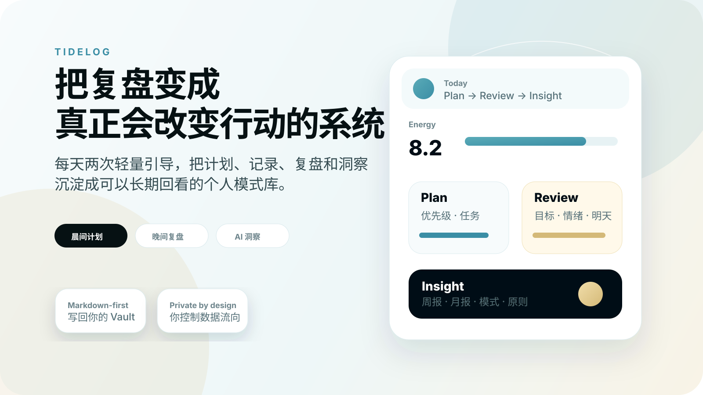
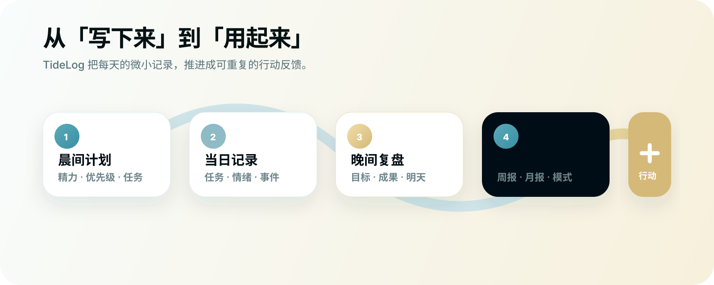
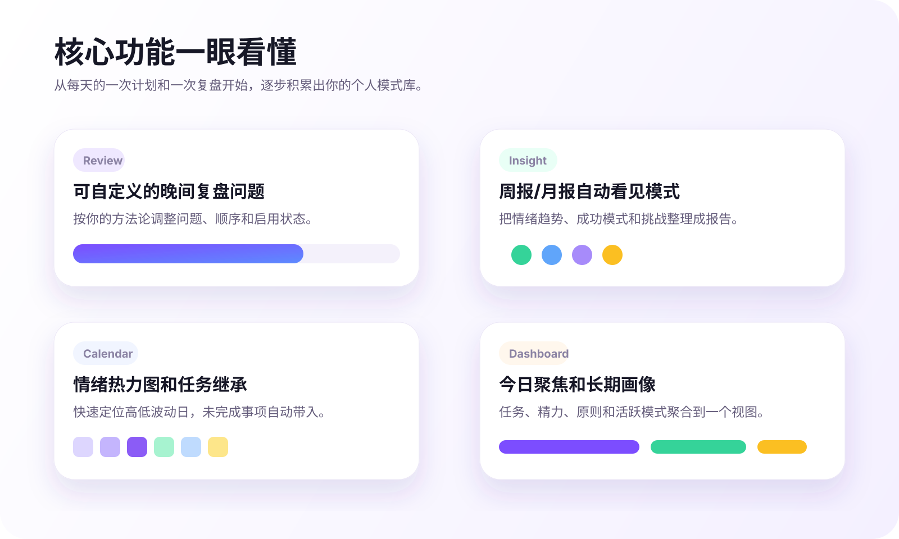

  

<h1 align="center">TideLog</h1>

  <strong>把每天的计划、复盘和洞察，变成真正会改变行动的系统。</strong>

  计划 · 复盘 · 洞察 · 行动 · Markdown-first

## TideLog 是什么

TideLog 不是一个更复杂的日记模板，也不是又一个任务清单。

它是一套在 Obsidian 里运行的日常成长闭环：早上帮你把一天变清楚，晚上帮你把经历复盘成可用信息，再用 AI 把周/月趋势、情绪波动、反复出现的模式和可复用原则沉淀下来。

> 目标不是“多写一点”，而是让你已经写下来的内容，真正反过来影响下一步行动。

## 它解决的问题

| 如果你现在这样 | TideLog 会帮你这样做 |
|---|---|
| 每天都写 Daily note，但很少回看 | 把计划、任务、情绪和复盘写成固定结构，后续可以被检索、统计和总结 |
| 晚上想复盘，却经常只写流水账 | 用可自定义问题引导你回看目标、成果、焦虑、情绪和明天行动 |
| 记录很多，但看不见长期模式 | 自动生成周报、月报、情绪趋势、成功模式、挑战分析和原则沉淀 |
| 想用 AI 理解自己，但不想把系统搬出 Vault | 在自己的 Obsidian 工作流里完成计划、复盘、洞察和对话 |
| 害怕数据被锁进新工具 | 核心内容写回 Markdown 文件，文件夹路径可以自己配置 |

## 核心体验

### 🌅 晨间计划

用一个轻量 SOP 开始当天：评估精力、明确优先级、记录任务和子任务，并自动继承过去几天未完成的事项。

### 🌙 晚间复盘

用一组可编辑、可排序、可启停的问题完成复盘。你可以使用默认问题，也可以把它改成自己的方法论。

### 🧭 AI 洞察

把每天的复盘进一步整理成周报、月报、情绪趋势、行为模式、用户画像建议和可复用原则。

### 📊 可视化视图

通过 Dashboard、日历热力图和 Kanban 视图，把任务、情绪、计划和长期模式放到更容易回看的位置。

## 适合谁

- 已经在 Obsidian 里写日记、Daily note、周/月复盘，但希望它们更有行动反馈。
- 希望 AI 长期理解自己的行为模式，而不是只做一次性聊天。
- 想把任务、情绪、原则、模式和个人成长记录沉淀在自己的 Markdown Vault 中。
- 正在搭建第二大脑、个人操作系统、复盘系统或独立工作流。

如果你只是想偶尔写一篇日记，TideLog 可能不是必要工具。它更适合想把复盘变成稳定习惯，并希望从长期记录中得到反馈的人。

## 免费版与 Pro

TideLog 可以免费安装和试用。完整的长期复盘系统需要 TideLog Pro License。

| 功能 | 免费版 | Pro |
|---|---:|---:|
| 晨间计划 SOP | 支持 | 支持 |
| 使用自带 API Key 自由对话 | 支持 | 支持 |
| 基础任务记录与日记写入 | 支持 | 支持 |
| 晚间复盘问题 | 前 2 个 | 完整 5+4 流程 |
| 周报/月报洞察 | 不支持 | 支持 |
| 用户画像建议 | 不支持 | 支持 |
| Dashboard / 日历热力图 / Kanban | 不支持 | 支持 |
| 设备数 | 不适用 | 每个 License 3 台设备 |
| 离线宽限期 | 不适用 | 7 天 |

当前通过爱发电购买：

- 年度版：¥49/年。
- 终身版：¥99 一次性买断。
- 购买地址：<https://afdian.com/item/463307362c2f11f1b39d52540025c377>。

购买后，爱发电会提供 TideLog License。请在 **Obsidian 设置 → TideLog → Pro** 中输入激活。如果找不到 License，可以使用设置页中的 License portal，凭购买邮箱和爱发电订单号查询。

## 数据、隐私与网络请求

TideLog 的默认原则是：你的日常记录留在你的 Vault 中；只有你主动触发需要网络的功能时，才会发起 HTTPS 请求。

TideLog 会在这些场景读取或写入 Vault：

- 扫描你配置的日记、计划和归档文件夹，用于日历热力图、Dashboard、Kanban、任务继承和周/月总结。
- 读取相关笔记，用于渲染视图、继承未完成任务，或生成你主动触发的 AI 提示词。
- 在你配置的文件夹中创建或更新晨间计划、晚间复盘、任务、洞察报告、模板和缓存文件。

TideLog 只在以下场景发起网络请求：

1. **AI API calls**：使用晨间计划、晚间复盘、洞察生成或自由对话等 AI 功能时，会将相关提示词和必要笔记内容发送到你在设置中配置的 AI 服务商。
2. **Connection tests**：点击测试连接按钮时，会向所选 AI 服务商验证 API Key 和模型配置。
3. **License activation and verification**：激活或验证 Pro 时，会向 `https://tidelog-api.mydreamchronicle.com` 发送 License key 和生成的设备标识符，用于授权验证和 3 台设备限制。授权请求不包含 Vault 笔记内容。
4. **Purchase and License portal links**：设置页按钮会在浏览器中打开爱发电或 `https://tidelog-api.mydreamchronicle.com/portal`，此操作由用户主动触发。

TideLog 不包含客户端遥测、分析 SDK、动态广告或自动更新机制。TideLog 不访问 Obsidian Vault 之外的文件。完整隐私说明见 [PRIVACY.md](./PRIVACY.md)。

## Support

- GitHub issues: <https://github.com/enhen3/Tidelog/issues>
- License activation support: 请附上爱发电订单号、License key 前缀、设备错误提示和 TideLog 版本。
- 请不要在公开 issue 中粘贴完整 API Key、完整 License key 或私人日记内容。

## License

TideLog source code is licensed under the GNU Affero General Public License v3.0. TideLog Pro access, the official license service, and paid distribution terms remain commercial product terms. See [LICENSE](./LICENSE).

---

English overview

# TideLog

Turn daily planning, evening review, and AI insights into a durable personal growth system in your Markdown vault.

TideLog helps you run a repeatable **Plan → Review → Insight → Action** loop:

- **Plan the day** with a guided morning SOP for energy, priorities, tasks, subtasks, and carry-forward items.
- **Review the day** with customizable evening questions instead of staring at a blank page.
- **Find patterns** with weekly/monthly insight reports, emotion trends, principles, and recurring behaviors.
- **Keep ownership** of your notes: TideLog writes Markdown files to your configured folders and only calls external services when you trigger AI or license features.

The free version lets you try the core workflow. TideLog Pro unlocks the full evening review flow, weekly/monthly insights, profile suggestions, dashboard, calendar heatmap, and Kanban views.

TideLog makes outbound HTTPS requests only for AI calls, AI connection tests, license activation/verification, and user-initiated purchase or license portal links. It does not include client-side telemetry, analytics SDKs, dynamic ads, or any self-update mechanism.

See [PRIVACY.md](./PRIVACY.md) for the full privacy policy.

